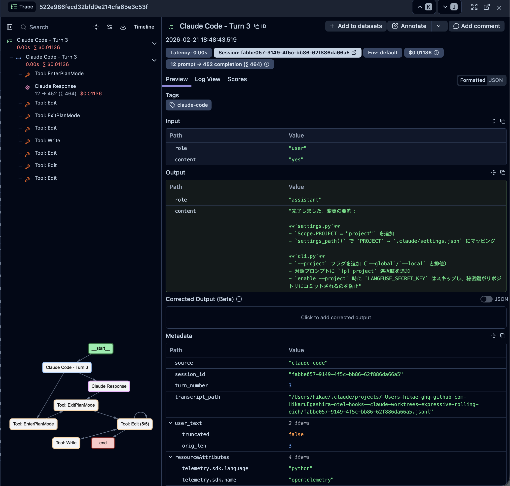

# otel-hooks

[](https://scorecard.dev/viewer/?uri=github.com/HikaruEgashira/otel-hooks)
[](https://pypi.org/project/otel-hooks/)

AI coding tools tracing hooks for observability. Supports **Claude Code**, **Cursor**, and **Codex CLI**.



## Install

```bash
mise use -g pipx:otel-hooks
```

```bash
pip install otel-hooks
```

## Supported tools

| Tool | Mechanism | Setup |
|------|-----------|-------|
| **Claude Code** | Stop hook → transcript parsing | `otel-hooks enable --tool claude` |
| **Cursor** | Stop hook (v1.7+ beta) | `otel-hooks enable --tool cursor` |
| **Codex CLI** | Native OTLP (`~/.codex/config.toml`) | `otel-hooks enable --tool codex` |

## Usage

```bash
otel-hooks enable                  # interactive tool/provider selection
otel-hooks enable --tool claude    # configure Claude Code
otel-hooks enable --tool cursor    # register hook in .cursor/hooks.json
otel-hooks enable --tool codex     # write [otel] to ~/.codex/config.toml

otel-hooks status                  # show status for all tools
otel-hooks status --tool claude    # show status for a specific tool
otel-hooks doctor --tool claude    # detect and fix issues
otel-hooks disable --tool cursor   # remove the hook
```

### Scope flags (Claude Code)

```bash
otel-hooks enable --tool claude --global   # ~/.claude/settings.json
otel-hooks enable --tool claude --project  # .claude/settings.json
otel-hooks enable --tool claude --local    # .claude/settings.local.json
```

## How it works

- **Claude Code / Cursor**: `enable` registers a [Stop hook](https://docs.anthropic.com/en/docs/claude-code/hooks) that runs `otel-hooks hook` after each response. The hook reads the session transcript incrementally and emits traces to the configured provider.
- **Codex CLI**: Codex has native OTLP support. `enable` writes the `[otel]` section to `~/.codex/config.toml` with the appropriate endpoint and auth headers.

## Providers

| Provider | Install | Description |
|----------|---------|-------------|
| Langfuse | `pip install otel-hooks[langfuse]` | Traces to Langfuse |
| OTLP | `pip install otel-hooks[otlp]` | Traces via OpenTelemetry OTLP |

## Environment variables

| Variable | Description |
|---|---|
| `OTEL_HOOKS_PROVIDER` | Provider name (`langfuse` or `otlp`) |
| `OTEL_HOOKS_ENABLED` | Set `true` to enable |
| `LANGFUSE_PUBLIC_KEY` | Langfuse public key |
| `LANGFUSE_SECRET_KEY` | Langfuse secret key |
| `LANGFUSE_BASE_URL` | Langfuse host (default: `https://cloud.langfuse.com`) |
| `OTEL_EXPORTER_OTLP_ENDPOINT` | OTLP endpoint URL |
| `OTEL_EXPORTER_OTLP_HEADERS` | OTLP headers (`key=value,key=value`) |
| `OTEL_HOOKS_DEBUG` | Set `true` to enable debug logging |
| `OTEL_HOOKS_MAX_CHARS` | Truncation limit per message (default: `20000`) |

## References

- [Claude Code Integration with Langfuse](https://langfuse.com/integrations/other/claude-code) – Langfuse official guide for Claude Code tracing
- [Entire CLI](https://github.com/entireio/cli) – AI agent session capture for git workflows

## License

MIT
